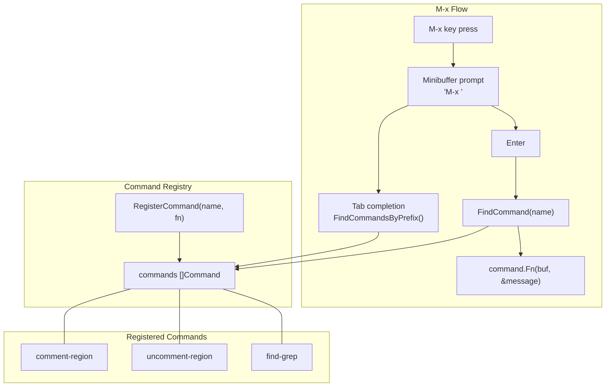
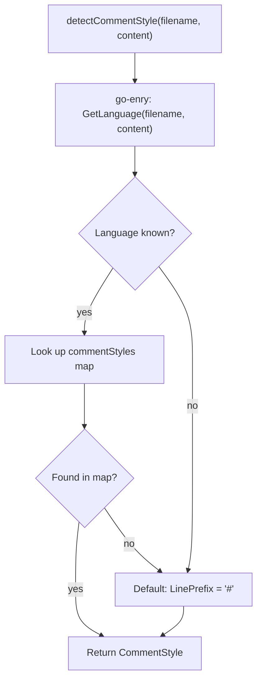
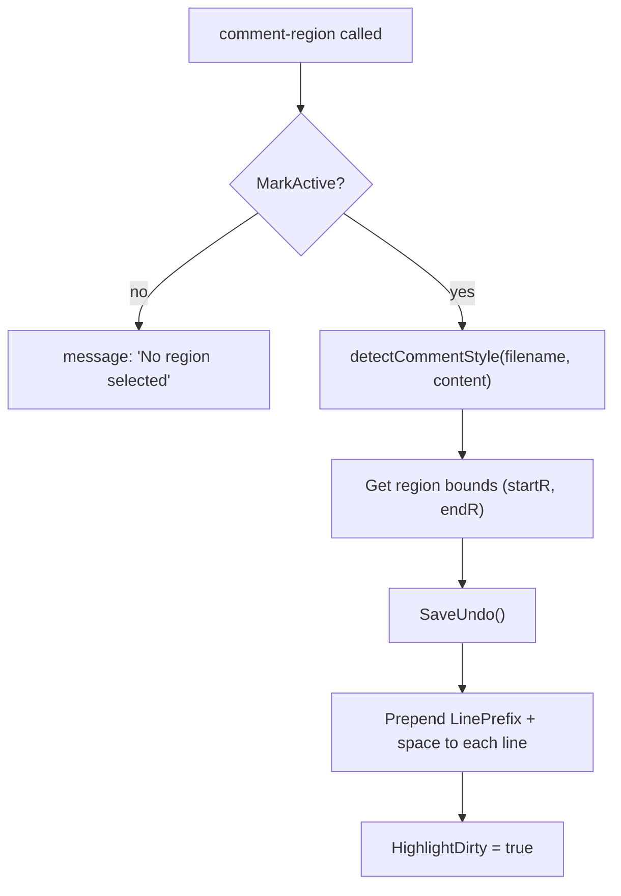
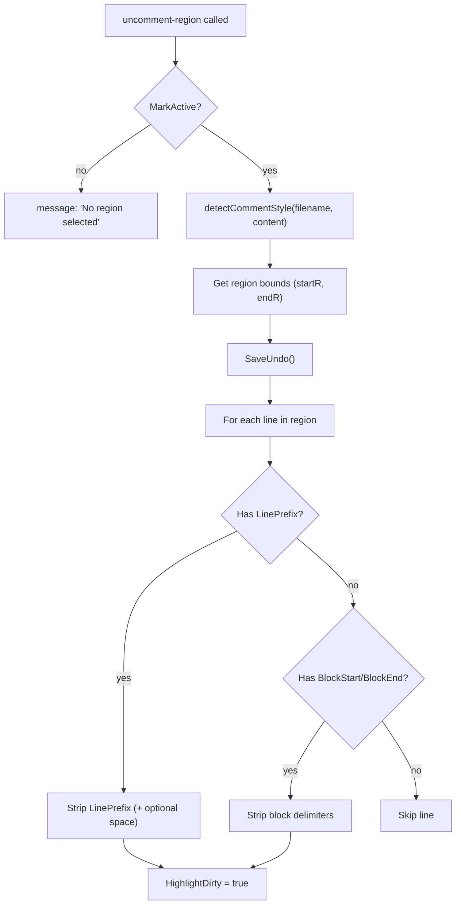

# Command System (command.go)

The command system in `command.go` provides a registry for named commands accessible via `M-x`, along with language-aware comment/uncomment operations using [go-enry](https://github.com/go-enry/go-enry) for language detection.

## Architecture



## Types

### Command

```go
type Command struct {
    Name string
    Fn   func(*Buffer, *string)
}
```

- `Name` -- Command name as typed in the M-x prompt (e.g., `"comment-region"`)
- `Fn` -- Function receiving the active buffer and a pointer to the message string for status feedback

### CommentStyle

```go
type CommentStyle struct {
    LinePrefix string  // e.g., "//"
    BlockStart string  // e.g., "/*"
    BlockEnd   string  // e.g., "*/"
}
```

Defines comment delimiters for a programming language. `LinePrefix` is used for single-line comments; `BlockStart`/`BlockEnd` are used for block comments.

## Registry API

| Function | Purpose |
|----------|---------|
| `RegisterCommand(name, fn)` | Adds a command to the global registry |
| `FindCommand(name) *Command` | Returns exact match by name, or nil |
| `FindCommandsByPrefix(prefix) []Command` | Returns all commands with matching prefix (for tab completion) |

Commands are registered via `init()` functions, allowing `grep.go` and `command.go` to independently register their commands without coupling.

## Comment / Uncomment Operations

### Language Detection



### Supported Languages

The `commentStyles` map covers 30+ languages:

| Language Group | Languages | Line Prefix | Block Delimiters |
|---------------|-----------|-------------|-----------------|
| C-family | Go, C, C++, Java, JavaScript, TypeScript, Rust, Kotlin, Swift, PHP, SCSS | `//` | `/* */` |
| Scripting | Python, Ruby, Shell, Perl, R, YAML, TOML, Makefile | `#` | -- |
| Lisp-family | Lisp, Clojure, Scheme | `;;` | -- |
| Markup | HTML, XML | -- | `<!-- -->` |
| Functional | Haskell | `--` | `{- -}` |
| Other | Lua (`--`), SQL (`--`), Erlang (`%`), Elixir (`#`), CSS (`/* */`) | varies | varies |

### comment-region



### uncomment-region



Uncomment tolerates leading whitespace before comment markers.
