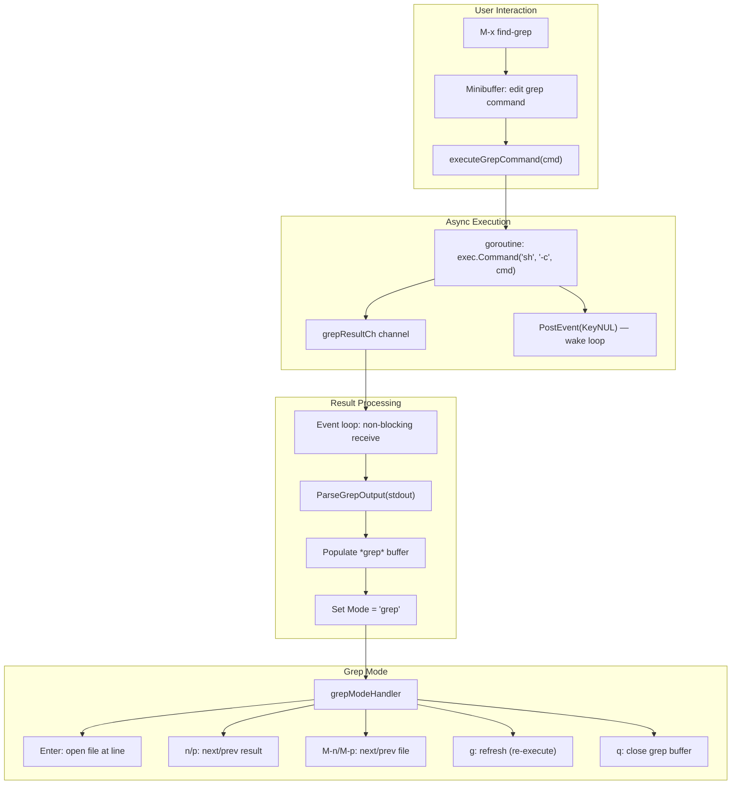
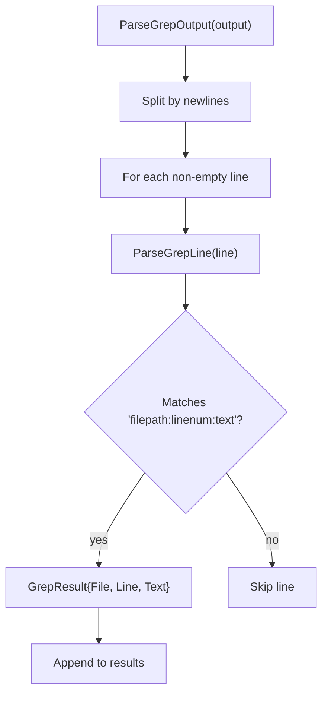
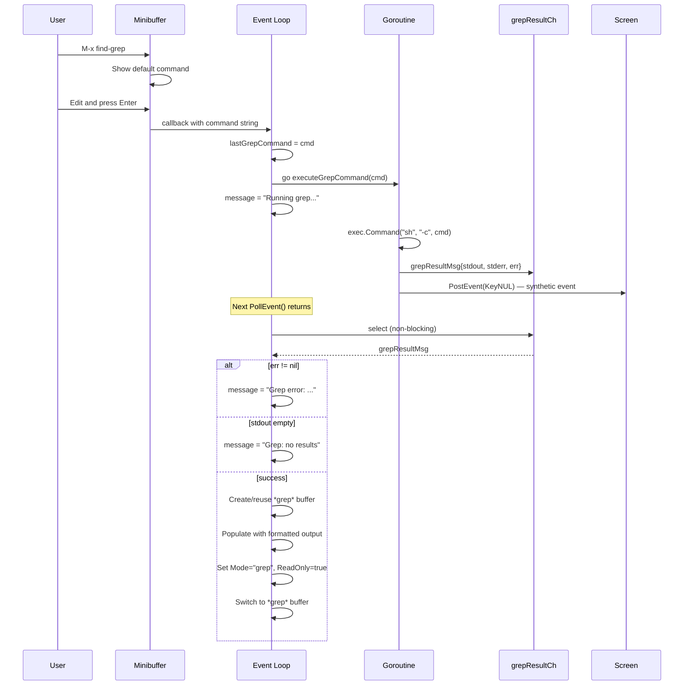
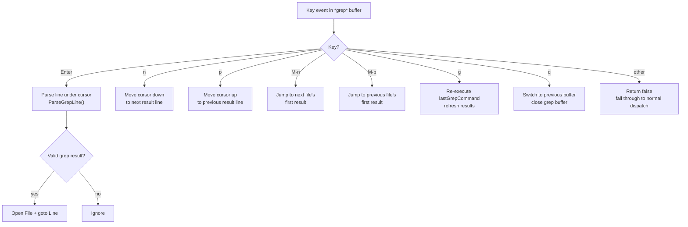
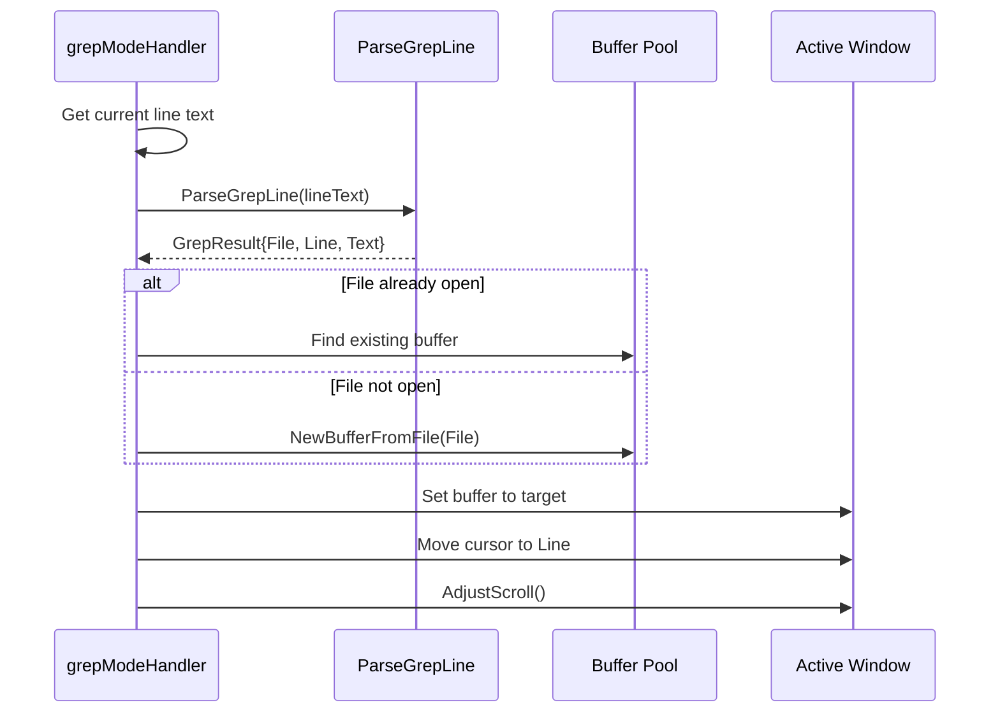

# Find-Grep (grep.go)

The find-grep feature in `grep.go` provides project-wide text search with result navigation, modeled after Emacs `M-x grep`. Results are displayed in a special `*grep*` buffer with a dedicated mode handler for navigating and jumping to matches.

## Architecture



## Types

### GrepResult

```go
type GrepResult struct {
    File string  // filepath from grep output
    Line int     // line number
    Text string  // matched line text
}
```

### grepResultMsg

```go
type grepResultMsg struct {
    stdout string
    stderr string
    err    error
}
```

Internal message type for communicating async grep results via channel.

## Global State

| Variable | Type | Purpose |
|----------|------|---------|
| `lastGrepCommand` | `string` | Most recently executed grep command (used by `g` refresh) |
| `editorScreen` | `term.Screen` | Reference to terminal screen for `PostEvent()` from goroutines |
| `grepResultCh` | `chan grepResultMsg` | Channel for receiving async grep results |

## Grep Output Parsing



`ParseGrepLine` uses `strings.SplitN(line, ":", 3)` and validates that the second field is a valid integer (line number).

## Async Execution Flow



The `PostEvent(KeyNUL)` trick is essential: it sends a no-op event to wake the event loop from its blocking `PollEvent()` call, allowing it to check `grepResultCh`.

## Default Grep Command

The default command presented in the minibuffer is:

```
find . -type f -exec grep -nH -e '' {} +
```

The user can edit this freely before execution. The cursor is pre-positioned at the empty search pattern (`''`).

## Grep Mode Handler

When a `*grep*` buffer is active, the `grepModeHandler` intercepts key events:



### Enter: Jump to Source



### M-n / M-p: File-Level Navigation

These commands skip to the first result of the next (or previous) file in the grep output. They parse lines to detect file boundaries, jumping past all results from the current file.

### g: Refresh

Re-executes `lastGrepCommand` via `executeGrepCommand()`, replacing the current grep buffer contents with fresh results. Useful when source files have been edited.

### q: Quit

Switches to `previousBufferIdx` and closes the `*grep*` buffer, restoring the editor to the state before grep was invoked.

## Grep Buffer Format

The `*grep*` buffer displays results in the standard grep format:

```
./main.go:42:    func main() {
./main.go:105:   screen.Clear()
./buffer.go:10:  type Buffer struct {
./buffer.go:55:  func (b *Buffer) InsertChar(ch rune) {
```

Each line is parseable by `ParseGrepLine()`, enabling the Enter-to-jump feature.

## Registration

Commands and mode handlers are registered in `grep.go`'s `init()` function:

```go
func init() {
    RegisterCommand("find-grep", findGrepCommand)
    modeHandlers["grep"] = grepModeHandler
}
```

This decoupled registration means `grep.go` depends on `command.go` (for `RegisterCommand`) and `main.go` (for `modeHandlers`), but neither depends on `grep.go`.
