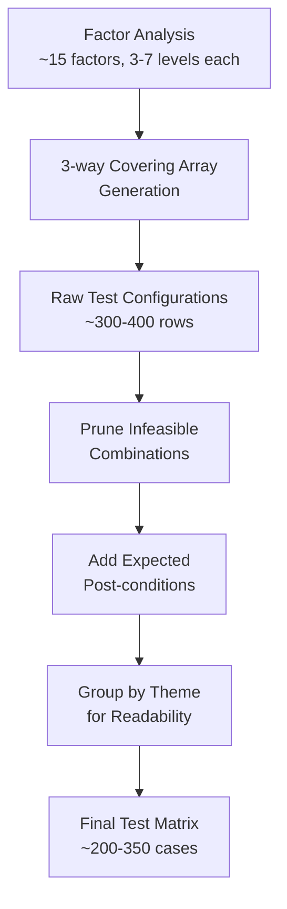

# PRD: Comprehensive E2E Testing Framework for Quality Improvement

## Introduction

Expand the goomacs E2E test suite from its current 48-test baseline into a rigorous, systematically designed test framework that covers all editor modes, key bindings, boundary conditions, and invalid/no-op inputs. The approach follows a structured methodology: factor analysis, combinatorial test matrix design (3-way coverage), automated test implementation, failure recording, and bug fixing. The existing `e2e/` test suite remains intact; this effort adds a parallel comprehensive suite alongside it.

### Problem Statement

The current E2E suite covers approximately 40% of implemented features. Critical gaps include:
- No tests for arrow key navigation, comment/uncomment commands, or tab expansion
- No tests for invalid/no-op key presses (e.g., pressing `n` in normal mode when it should just insert)
- No tests for mode transition edge cases (e.g., C-x followed by an invalid key)
- No boundary condition tests (empty buffers, single-character buffers, maximum undo stack)
- No stress or rapid-input tests
- No tests for the interaction between features (e.g., search while region is active, undo after yank)

## Goals

- Systematically identify all testable factors and their interactions via a factor analysis table
- Design a 3-way combinatorial test matrix that achieves meaningful coverage without explosion
- Implement all test cases as automated, deterministic E2E tests runnable in CI
- Record all failures in a machine-parseable JSON log for triage
- Fix all critical and high-severity bugs discovered, achieving zero known critical/high failures
- Produce a maintainable, extensible test suite that scales with future features

## User Stories

### US-001: Factor Analysis Table
**Description:** As a developer, I want a structured table enumerating all testable factors so that I can reason about coverage systematically.

**Acceptance Criteria:**
- [ ] Create `tasks/e2e-factor-analysis.md` containing a factor table
- [ ] Factors are organized by category: Editor Mode, Cursor Position, Buffer State, Key Input, File State, Terminal Dimensions, Window Configuration
- [ ] Each factor lists all possible levels (values), e.g., Mode = {Normal, Search, Minibuffer, Confirm, C-x Prefix, Grep}
- [ ] Include "no-op / irrelevant key" as an explicit factor level for Key Input: keys that should have no effect in a given mode (e.g., `n` in confirm mode, `C-x` in search mode)
- [ ] Each factor is assigned a priority: Critical (must test), Important (should test), Edge-case (nice to have)
- [ ] Factor table includes at least these categories:

| Category | Example Factors | Example Levels |
|----------|----------------|----------------|
| Editor Mode | Current mode | Normal, Search Forward, Search Backward, Minibuffer, Confirm, C-x Prefix, Grep |
| Cursor Position | Row position | First line, Middle, Last line, Beyond content |
| Cursor Position | Column position | Column 0, Middle of line, End of line, End of empty line |
| Buffer State | Content type | Empty (single blank line), Single char, Single line, Multi-line, Very long line, Tabs present |
| Buffer State | Modification | Unmodified, Modified |
| Buffer State | Mark | Inactive, Active (same line), Active (multi-line) |
| Buffer State | Kill ring | Empty, Has entries |
| Buffer State | Undo stack | Empty, Has entries, At max (100) |
| Buffer State | Read-only | false, true |
| Key Input | Key class | Movement, Editing, Kill/Yank, Search, C-x prefix, M-x, No-op/invalid |
| File State | File backing | No file (*scratch*), Existing file, New file (unsaved) |
| File State | Highlighter | nil (no lexer), Active (Go, Python, etc.) |
| Window Config | Window count | Single, Two (vertical), Two (horizontal) |
| Window Config | Active window | First, Second |
| Terminal Size | Dimensions | 80x24 (standard), 40x10 (small), 200x50 (large) |

- [ ] Document rationale for priority assignments

### US-002: Test Matrix Design
**Description:** As a developer, I want a combinatorial test matrix that covers 3-way factor interactions so that I can achieve high coverage without combinatorial explosion.

**Acceptance Criteria:**
- [ ] Create `tasks/e2e-test-matrix.md` containing the test matrix
- [ ] Use 3-way (t=3) combinatorial coverage: every combination of any 3 factor levels appears in at least one test case
- [ ] Each row in the matrix defines: Test Case ID, factor values, input sequence (keystrokes), expected post-condition (cursor position, buffer content, mode, message line, status bar)
- [ ] Group test cases by theme for readability: Movement, Editing, Kill/Yank, Search, Buffer Management, Window Management, Grep Mode, Minibuffer, Error Handling / No-ops
- [ ] Document excluded combinations with rationale (e.g., "Grep mode + confirm mode cannot coexist because grep buffers don't trigger confirm prompts")
- [ ] Target: 200-400 test cases total (practical for 3-way coverage of ~15 factors with 3-7 levels each)
- [ ] Each test case has a unique ID in format `TC-{group}-{number}` (e.g., `TC-MOV-001`, `TC-EDIT-015`, `TC-NOOP-003`)

### US-003: No-Op and Invalid Input Test Cases
**Description:** As a developer, I want explicit test cases for keys that should have no effect so that I verify the editor handles unexpected input gracefully.

**Acceptance Criteria:**
- [ ] Define no-op test cases for each editor mode:

| Mode | No-op Keys to Test | Expected Behavior |
|------|-------------------|-------------------|
| Normal | Unbound control sequences (e.g., C-q, C-o) | No change to buffer, no crash |
| Search | C-x, C-v, M-< | Exit search, re-post event (for C-x); or no action |
| Minibuffer | C-n, C-p, C-v, M-< | No visible effect |
| Confirm | Any key except y, n, C-g | No change, stays in confirm mode |
| C-x Prefix | Invalid second key (e.g., C-x a, C-x z) | Cancel prefix, show message or no action |
| Grep | Unbound keys (e.g., x, C-f) | Falls through to normal mode or no action |

- [ ] Test rapid repeated no-op keys (10+ repeats) — editor must not crash or enter inconsistent state
- [ ] Test mode transitions after no-op: verify mode state is preserved correctly
- [ ] At least 30 no-op/invalid input test cases across all modes

### US-004: Boundary Condition Test Cases
**Description:** As a developer, I want tests that exercise boundary conditions so that edge cases are covered.

**Acceptance Criteria:**
- [ ] Empty buffer boundary tests:
  - [ ] Backspace at position (0,0) in empty buffer — no change
  - [ ] C-d at position (0,0) in empty buffer — no change
  - [ ] C-k at position (0,0) in empty buffer — no change (or kills empty line if > 1 line)
  - [ ] C-f / C-n at end of buffer — no movement
  - [ ] C-b / C-p at beginning of buffer — no movement
  - [ ] C-y with empty kill ring — no change
  - [ ] Undo with empty undo stack — no change, message "No undo information"
- [ ] Single character buffer tests:
  - [ ] Delete the only character, then undo
  - [ ] Kill the only line, then yank
- [ ] Large content tests:
  - [ ] Buffer with 1000+ lines: page up/down, goto line, search
  - [ ] Very long line (500+ chars): horizontal cursor movement at line end
- [ ] Undo stack limit:
  - [ ] Perform 101+ edits, undo 100 times — verify oldest edit is lost
- [ ] Kill ring accumulation:
  - [ ] 50+ consecutive C-k calls — all accumulated in one entry
- [ ] Window at minimum size:
  - [ ] Split windows until each has 2-3 rows — verify rendering doesn't crash

### US-005: E2E Test Implementation — Movement & Cursor
**Description:** As a developer, I want automated E2E tests for all cursor movement operations across various buffer states.

**Acceptance Criteria:**
- [ ] Test all movement keys: C-f, C-b, C-n, C-p, C-a, C-e, C-v, M-v, M-<, M->
- [ ] Test arrow keys: Left, Right, Up, Down
- [ ] Test each movement at boundary positions (start of buffer, end of buffer, start of line, end of line)
- [ ] Test C-f at end of line wraps to next line
- [ ] Test C-b at start of line wraps to previous line
- [ ] Test C-n/C-p with column clamping (moving from long line to short line)
- [ ] Test page up/down near buffer boundaries (less than one page remaining)
- [ ] Tests are in `e2e/comprehensive_movement_test.go`
- [ ] All tests pass
- [ ] `go vet ./e2e/...` passes

### US-006: E2E Test Implementation — Editing Operations
**Description:** As a developer, I want automated E2E tests for all text editing operations including edge cases.

**Acceptance Criteria:**
- [ ] Test InsertChar with ASCII, multi-byte UTF-8, and tab characters
- [ ] Test tab expansion: tab at column 0 expands to 8 spaces visually, tab at column 3 expands to 5 spaces
- [ ] Test Backspace: middle of line, start of line (join), in empty buffer
- [ ] Test C-d: middle of line, end of line (join), in empty buffer
- [ ] Test Enter/C-j: middle of line (split), end of line, start of line
- [ ] Test editing in read-only buffer: verify all editing keys are blocked, message shown
- [ ] Tests are in `e2e/comprehensive_editing_test.go`
- [ ] All tests pass
- [ ] `go vet ./e2e/...` passes

### US-007: E2E Test Implementation — Kill, Yank, Region
**Description:** As a developer, I want automated E2E tests for kill ring, yank, and region operations.

**Acceptance Criteria:**
- [ ] Test C-k: at end of line (joins), empty line, consecutive kills accumulate
- [ ] Test C-k then non-kill key then C-k: verify kill ring entries are separate
- [ ] Test C-w: single-line region, multi-line region, zero-width region (mark == point)
- [ ] Test M-w: copies without deleting, verify subsequent C-y pastes correctly
- [ ] Test C-y: single-line yank, multi-line yank, yank into empty buffer
- [ ] Test C-y with empty kill ring: no change
- [ ] Test region + yank interaction: set mark, move, kill region, move elsewhere, yank
- [ ] Tests are in `e2e/comprehensive_killyank_test.go`
- [ ] All tests pass
- [ ] `go vet ./e2e/...` passes

### US-008: E2E Test Implementation — Search Mode
**Description:** As a developer, I want automated E2E tests for incremental search in all edge cases.

**Acceptance Criteria:**
- [ ] Test search with no matches: "Failing I-search" message shown
- [ ] Test search wrap-around: forward search wraps from end to beginning
- [ ] Test backward search wrap-around: wraps from beginning to end
- [ ] Test search cancel (C-g): cursor returns to original position
- [ ] Test search accept (Enter): cursor stays at match
- [ ] Test search exit via unrecognized key: key is re-processed in normal mode
- [ ] Test search with empty query: no crash, handles gracefully
- [ ] Test search query modification: backspace in search query re-searches from original position
- [ ] Test switching direction: C-s to start forward, then C-r to reverse
- [ ] Tests are in `e2e/comprehensive_search_test.go`
- [ ] All tests pass
- [ ] `go vet ./e2e/...` passes

### US-009: E2E Test Implementation — Undo
**Description:** As a developer, I want automated E2E tests for the undo system including limits.

**Acceptance Criteria:**
- [ ] Test undo of character insertion: insert char, undo, verify char removed
- [ ] Test undo of deletion: delete char, undo, verify char restored
- [ ] Test undo of kill line: kill, undo, verify line restored
- [ ] Test undo of region kill: kill region, undo, verify region restored
- [ ] Test undo of yank: yank, undo, verify yanked text removed
- [ ] Test undo of newline insertion: insert newline, undo, verify lines joined
- [ ] Test undo stack empty: undo with no changes, verify no crash and appropriate message
- [ ] Test undo stack limit: perform 101 edits, undo 100 times, verify 101st edit cannot be undone
- [ ] Test undo after save: undo is still available after saving
- [ ] Tests are in `e2e/comprehensive_undo_test.go`
- [ ] All tests pass
- [ ] `go vet ./e2e/...` passes

### US-010: E2E Test Implementation — Buffer Management
**Description:** As a developer, I want automated E2E tests for multi-buffer operations and edge cases.

**Acceptance Criteria:**
- [ ] Test C-x C-f with existing file: file opens, content shown, highlighter attached for known extensions
- [ ] Test C-x C-f with nonexistent file: new empty buffer created with filename set
- [ ] Test C-x C-f with same file already open: switches to existing buffer (no duplicate)
- [ ] Test C-x b with default (previous buffer): verify switching
- [ ] Test C-x b with typed buffer name: verify switching
- [ ] Test C-x k on unmodified buffer: closes without confirmation
- [ ] Test C-x k on modified buffer: y confirms close, n cancels
- [ ] Test C-x k on last buffer: verify behavior (new scratch buffer or error)
- [ ] Test C-x C-b: buffer list shows all buffers with correct markers (> for current, * for modified)
- [ ] Test C-x C-b then Enter: switches to selected buffer
- [ ] Test opening multiple files from command line arguments
- [ ] Tests are in `e2e/comprehensive_buffer_test.go`
- [ ] All tests pass
- [ ] `go vet ./e2e/...` passes

### US-011: E2E Test Implementation — Window Management
**Description:** As a developer, I want automated E2E tests for window splitting, switching, and closing edge cases.

**Acceptance Criteria:**
- [ ] Test C-x 2: vertical split, both windows show same buffer, status lines correct
- [ ] Test C-x 3: horizontal split, both windows show same buffer, separator drawn
- [ ] Test C-x o: cycles through windows correctly
- [ ] Test C-x 0: closes current window, recalculates layout
- [ ] Test C-x 0 with only one window: verify error message or no action
- [ ] Test C-x 1: closes all other windows
- [ ] Test editing in split windows: edit in window 0, verify change visible in window 1 (same buffer)
- [ ] Test independent scroll: scroll in window 0, verify window 1 scroll unchanged
- [ ] Test split with different buffers: open file in window, split, switch buffer in one window
- [ ] Tests are in `e2e/comprehensive_window_test.go`
- [ ] All tests pass
- [ ] `go vet ./e2e/...` passes

### US-012: E2E Test Implementation — Minibuffer
**Description:** As a developer, I want automated E2E tests for minibuffer input, cursor movement, and tab completion.

**Acceptance Criteria:**
- [ ] Test minibuffer cursor movement: C-a, C-e, C-f, C-b within input
- [ ] Test minibuffer editing: C-d (delete forward), C-k (kill to end), Backspace
- [ ] Test minibuffer cancel: C-g clears input and returns to normal mode
- [ ] Test minibuffer cancel: Esc clears input and returns to normal mode
- [ ] Test Tab completion for file paths: partial path completes to longest common prefix
- [ ] Test Tab completion for M-x commands: partial command completes
- [ ] Test Tab with no matches: no change, or message "No completions"
- [ ] Test Tab with single match: completes fully
- [ ] Test minibuffer with empty input + Enter: verify behavior per prompt type
- [ ] Tests are in `e2e/comprehensive_minibuffer_test.go`
- [ ] All tests pass
- [ ] `go vet ./e2e/...` passes

### US-013: E2E Test Implementation — Grep Mode
**Description:** As a developer, I want automated E2E tests for grep mode interactions and edge cases.

**Acceptance Criteria:**
- [ ] Test M-x find-grep invocation: minibuffer shows default command
- [ ] Test Enter on valid grep result line: opens correct file at correct line
- [ ] Test Enter on non-result line (e.g., empty line in grep buffer): no crash, no action
- [ ] Test n/p navigation: moves to next/previous result line
- [ ] Test n at last result: shows "No more results" message
- [ ] Test p at first result: shows "No more results" message
- [ ] Test M-n/M-p file navigation: jumps between files
- [ ] Test g (refresh): re-executes command, updates buffer content
- [ ] Test q: returns to previous buffer, closes grep buffer
- [ ] Test typing regular characters in grep buffer: falls through to normal mode (read-only blocks editing)
- [ ] Tests are in `e2e/comprehensive_grep_test.go`
- [ ] All tests pass
- [ ] `go vet ./e2e/...` passes

### US-014: E2E Test Implementation — Comment/Uncomment
**Description:** As a developer, I want automated E2E tests for the comment-region and uncomment-region commands.

**Acceptance Criteria:**
- [ ] Test comment-region on Go file: adds `// ` prefix to each line in region
- [ ] Test uncomment-region on Go file: removes `// ` prefix
- [ ] Test comment-region with no active region: shows error message
- [ ] Test comment-region on Python file: adds `# ` prefix
- [ ] Test uncomment-region tolerates leading whitespace before comment marker
- [ ] Test comment then uncomment round-trip: content returns to original
- [ ] Tests are in `e2e/comprehensive_comment_test.go`
- [ ] All tests pass
- [ ] `go vet ./e2e/...` passes

### US-015: E2E Test Implementation — No-Op and Invalid Input
**Description:** As a developer, I want automated E2E tests that verify the editor handles unexpected/no-op key presses gracefully.

**Acceptance Criteria:**
- [ ] Implement all no-op test cases defined in US-003
- [ ] Test C-x followed by invalid second key (C-x a, C-x z, C-x C-q): prefix cancelled, no crash
- [ ] Test unbound keys in normal mode (C-q, C-o, C-t): character inserted or no action, no crash
- [ ] Test rapid key repeat: send 100 C-f presses in quick succession — cursor stops at buffer end, no crash
- [ ] Test rapid mode switching: C-s then immediately C-g, repeated 20 times — no state corruption
- [ ] Test C-g in every mode: Normal (deactivate mark), Search (cancel), Minibuffer (cancel), Confirm (cancel), C-x prefix (cancel)
- [ ] Verify buffer content and cursor position are unchanged after every no-op
- [ ] Tests are in `e2e/comprehensive_noop_test.go`
- [ ] All tests pass
- [ ] `go vet ./e2e/...` passes

### US-016: E2E Test Implementation — Terminal Resize
**Description:** As a developer, I want automated E2E tests for terminal resize handling.

**Acceptance Criteria:**
- [ ] Test resize from 80x24 to 40x12: editor redraws correctly, content visible
- [ ] Test resize from 80x24 to 200x50: editor expands, no rendering artifacts
- [ ] Test resize with split windows: windows recalculate correctly
- [ ] Test resize during search mode: search state preserved
- [ ] Test resize during minibuffer input: input preserved
- [ ] Tests are in `e2e/comprehensive_resize_test.go`
- [ ] All tests pass
- [ ] `go vet ./e2e/...` passes

### US-017: E2E Test Implementation — Cross-Feature Interactions
**Description:** As a developer, I want E2E tests that verify correct behavior when multiple features interact.

**Acceptance Criteria:**
- [ ] Test search while region is active: mark deactivated or preserved correctly
- [ ] Test undo after yank: yanked text removed, cursor restored
- [ ] Test undo after kill region: region text restored, mark state correct
- [ ] Test C-x C-f during search mode: exits search, opens find-file prompt
- [ ] Test split window, then kill buffer in one window: window shows next buffer
- [ ] Test grep jump to file, edit, then g to refresh: grep results update
- [ ] Test comment-region then undo: comments removed
- [ ] Test save modified buffer then undo: buffer shows as modified again after undo
- [ ] Tests are in `e2e/comprehensive_interaction_test.go`
- [ ] All tests pass
- [ ] `go vet ./e2e/...` passes

### US-018: Failure Log Infrastructure
**Description:** As a developer, I want test failures recorded in a machine-parseable JSON log so that I can triage issues efficiently.

**Acceptance Criteria:**
- [ ] Create a test helper that writes failure records to `tasks/e2e-failures.json`
- [ ] Each failure record contains:
  ```json
  {
    "test_case_id": "TC-MOV-001",
    "test_name": "TestComprehensiveMovement/ForwardAtEndOfBuffer",
    "input_sequence": "C-f at position (0, 5) in 5-char buffer",
    "expected_state": "cursor at (0, 5), no movement",
    "actual_state": "cursor at (1, 0), wrapped to next line",
    "severity": "high",
    "category": "movement",
    "timestamp": "2026-03-16T12:00:00Z"
  }
  ```
- [ ] Severity levels: critical (crash/data loss), high (wrong behavior), medium (cosmetic), low (minor)
- [ ] Log is append-only during test run, can be reset before a new run
- [ ] Helper function signature: `RecordFailure(t, caseID, input, expected, actual, severity, category)`
- [ ] Log file is valid JSON (array of objects)
- [ ] `go vet ./e2e/...` passes

### US-019: Test Execution and Full Suite Run
**Description:** As a developer, I want to execute the full comprehensive E2E test suite and generate a complete failure report.

**Acceptance Criteria:**
- [ ] All comprehensive test files compile and run with `go test ./e2e/ -v -run Comprehensive -timeout 30m`
- [ ] Test execution completes without panics or hangs
- [ ] `tasks/e2e-failures.json` is generated with all detected failures
- [ ] Summary statistics printed at end: total tests, passed, failed by severity
- [ ] Tests are deterministic: running twice produces the same results
- [ ] Tests are isolated: each test creates its own tmux session and temp files

### US-020: Bug Triage and Fixes — Critical Severity
**Description:** As a developer, I want all critical-severity bugs (crashes, data loss) fixed so that the editor is stable.

**Acceptance Criteria:**
- [ ] Review all critical-severity entries in `tasks/e2e-failures.json`
- [ ] Fix each critical bug in the goomacs source code
- [ ] Re-run affected test cases to confirm fix
- [ ] Zero critical-severity failures remain after fixes
- [ ] No regressions introduced (existing E2E tests still pass)

### US-021: Bug Triage and Fixes — High Severity
**Description:** As a developer, I want all high-severity bugs (wrong behavior) fixed so that the editor behaves correctly.

**Acceptance Criteria:**
- [ ] Review all high-severity entries in `tasks/e2e-failures.json`
- [ ] Fix each high-severity bug in the goomacs source code
- [ ] Re-run affected test cases to confirm fix
- [ ] Zero high-severity failures remain after fixes
- [ ] No regressions introduced (existing E2E tests still pass)

### US-022: Bug Triage and Fixes — Medium and Low Severity
**Description:** As a developer, I want medium and low-severity bugs assessed and fixed where practical.

**Acceptance Criteria:**
- [ ] Review all medium and low-severity entries in `tasks/e2e-failures.json`
- [ ] Fix medium-severity bugs (cosmetic issues)
- [ ] Assess low-severity bugs: fix if simple, document as known issues if not
- [ ] Re-run full comprehensive suite to confirm all fixes
- [ ] Update `tasks/e2e-failures.json` with final state (all resolved or documented)

### US-023: Final Validation and Regression Check
**Description:** As a developer, I want a clean full-suite run confirming all fixes and no regressions.

**Acceptance Criteria:**
- [ ] Run complete test suite: `go test ./e2e/ -v -timeout 30m`
- [ ] All existing (baseline) E2E tests pass
- [ ] All comprehensive (new) E2E tests pass
- [ ] `tasks/e2e-failures.json` contains zero critical or high-severity entries
- [ ] `go vet ./...` passes
- [ ] `go build ./...` succeeds

## Functional Requirements

- FR-1: Factor analysis must enumerate all editor modes (Normal, Search Forward, Search Backward, Minibuffer, Confirm, C-x Prefix, Grep), all key bindings (50+ distinct bindings), all buffer states, and all window configurations
- FR-2: Factor analysis must explicitly include "no-op" and "invalid input" as factor levels, not just valid operations
- FR-3: Test matrix must achieve 3-way combinatorial coverage: every combination of any 3 factor levels appears in at least one test case
- FR-4: Each test case in the matrix must define a precise expected post-condition: cursor position, buffer content (at minimum the affected lines), mode, and message line text
- FR-5: Comprehensive tests must coexist with existing `e2e/` tests without conflict (separate test file names, no shared mutable state)
- FR-6: Tests must be deterministic and isolated: each test creates and destroys its own tmux session and temp files
- FR-7: Failure log must be machine-parseable JSON with test case ID, input, expected state, actual state, severity, and category
- FR-8: All bugs found must be fixed in the goomacs source code (not worked around in tests)
- FR-9: The final test suite must run to completion in under 30 minutes in CI
- FR-10: Test file naming convention: `e2e/comprehensive_{category}_test.go`

## Non-Goals

- No performance benchmarking or profiling (this is functional correctness only)
- No fuzz testing or property-based testing (structured combinatorial coverage instead)
- No testing of the `term/` package internals (covered by existing unit tests)
- No testing of build system, CI pipeline, or deployment
- No automated test generation tooling (matrix is manually designed, tests manually implemented)
- No cross-platform testing (Linux only, matching CI environment)
- No testing of features that don't exist (e.g., regex search, yank-pop, word movement)

## Design Considerations

### Test File Organization

```
e2e/
├── (existing tests — unchanged)
│   ├── basic_test.go
│   ├── navigation_test.go
│   ├── search_test.go
│   ├── killyank_test.go
│   ├── buffer_test.go
│   ├── window_test.go
│   ├── grep_test.go
│   └── highlight_test.go
│
├── (new comprehensive tests)
│   ├── comprehensive_movement_test.go
│   ├── comprehensive_editing_test.go
│   ├── comprehensive_killyank_test.go
│   ├── comprehensive_search_test.go
│   ├── comprehensive_undo_test.go
│   ├── comprehensive_buffer_test.go
│   ├── comprehensive_window_test.go
│   ├── comprehensive_minibuffer_test.go
│   ├── comprehensive_grep_test.go
│   ├── comprehensive_comment_test.go
│   ├── comprehensive_noop_test.go
│   ├── comprehensive_resize_test.go
│   ├── comprehensive_interaction_test.go
│   └── failure_logger.go        ← JSON failure recording helper
│
├── harness.go                   ← existing, unchanged
├── assertions.go                ← existing, may extend
└── testdata/                    ← golden files
```

### Test Naming Convention

All comprehensive test functions use the prefix `TestComprehensive` to allow selective execution:

```bash
# Run only comprehensive tests
go test ./e2e/ -v -run TestComprehensive -timeout 30m

# Run only existing baseline tests
go test ./e2e/ -v -run 'Test[^C]' -timeout 10m

# Run everything
go test ./e2e/ -v -timeout 30m
```

### Combinatorial Coverage Strategy



Infeasible combinations to prune:
- Grep mode + Confirm mode (grep buffers never trigger confirm)
- Read-only buffer + Editing operation (blocked at dispatch level, tested separately in no-op tests)
- Minibuffer mode + Window commands (C-x keys in minibuffer are not prefix keys)
- Search mode + C-x prefix (C-x in search exits search)

## Technical Considerations

- **tmux dependency**: Tests require tmux installed. CI already has this from existing E2E tests.
- **Timing sensitivity**: Use `WaitForContent()` with generous timeouts rather than fixed `time.Sleep()` where possible. Some operations (grep execution) are inherently async and need polling.
- **Parallel execution**: Each test uses a unique tmux session name. Tests within a file run sequentially (Go subtests), but test files can run in parallel if `-parallel` is used.
- **Harness extensions**: May need to extend `assertions.go` with helpers like `AssertCursorNotAt()`, `AssertBufferUnchanged()`, `AssertModeIs()` for comprehensive tests.
- **Failure logger**: Use `sync.Mutex` for thread-safe writes if tests ever run in parallel within a file.
- **JSON output**: Use `encoding/json` with `json.MarshalIndent` for human-readable failure logs.

## Success Metrics

- Factor analysis covers 100% of implemented key bindings, modes, and buffer states
- Test matrix achieves 3-way combinatorial coverage (verified by covering array properties)
- Total comprehensive test count: 200+ test cases
- Zero critical or high-severity failures after bug fixes
- Full test suite (baseline + comprehensive) completes in under 30 minutes
- All tests are deterministic: 3 consecutive runs produce identical pass/fail results
- Existing 48 baseline tests continue to pass without modification

## Open Questions

- Should we invest in a covering array generation tool (e.g., ACTS, Jenny) or manually construct the 3-way covering array?
- Should comprehensive tests reuse the existing `Harness` struct or create an extended version with richer assertion methods?
- What is the acceptable CI timeout for the full suite? (Proposed: 30 minutes)
- Should medium/low severity bugs that require significant refactoring be deferred to a separate effort?
